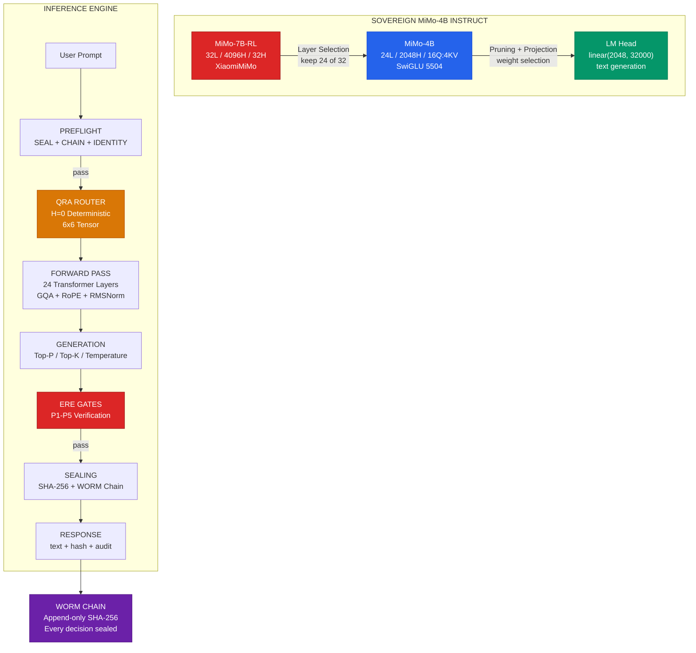
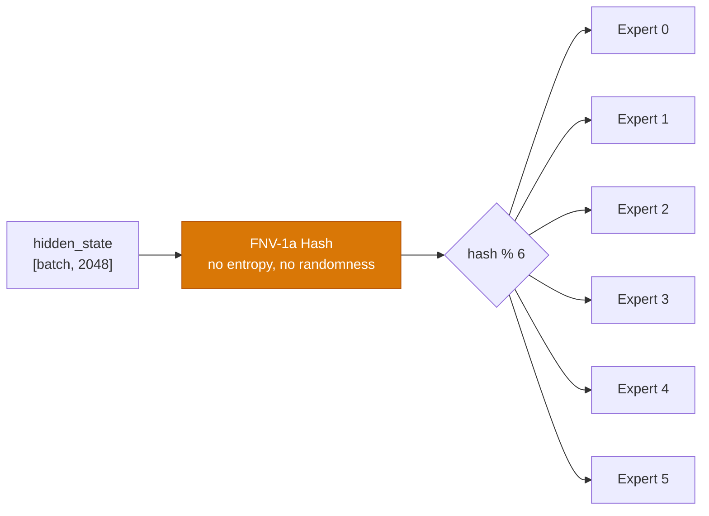
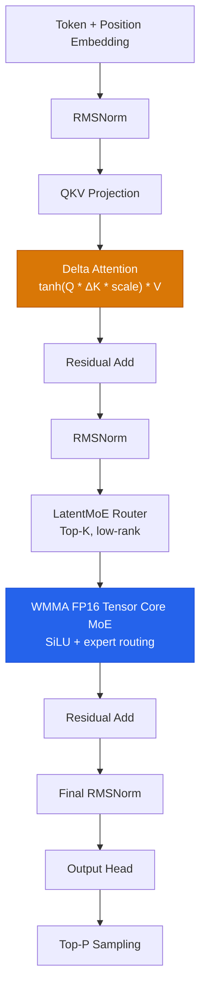

# Sovereign MiMo-4B

[](LICENSE)
[](config/architecture.json)
[](#hardware)
[](#qra-routing)
[](#kimi-k3-nano)
[](#kimi-k3-nano)
[](#deploy)
[](#ere-gates)

> **Pruned from MiMo-7B. Sovereign instruct model. FSM + ERE gates. WORM chain. No cloud.**

---

## Architecture



---

## What This Is

A 4B parameter sovereign instruct model pruned from MiMo-7B-RL. General-purpose instruction following — code generation, reasoning, question answering, task execution. Every output passes through ERE P1-P5 gates. Every decision is sealed to a WORM chain.

### Source → Target

| Parameter | MiMo-7B (Source) | MiMo-4B (Target) |
|-----------|-------------------|-------------------|
| Layers | 32 | 24 (pruned 8) |
| Hidden | 4096 | 2048 |
| Heads | 32 Q / 8 KV | 16 Q / 4 KV (GQA) |
| FFN | 11008 | 5504 (SwiGLU) |
| Vocab | 151936 | 32000 |
| Max Seq | 32768 | 8192 |
| LM Head | — | linear(2048, 32000) |
| Parameters | ~7B | ~4B |
| Size (Q4_K_M) | ~4.5 GB | ~2.5 GB |

### Pruning Strategy

```
Layer Selection:  keep layers 0-11, 13-24 (skip 12, 25-31)
                  → 24 layers, highest attention weight variance

Attention Heads:  q_proj: 32 → 16 heads (select every 2nd)
                  k_proj: 8 → 4 KV heads
                  v_proj: 8 → 4 KV heads
                  o_proj: 16 → 16 heads (output unchanged)

Feedforward:      gate_proj: 11008 → 5504 (select every 2nd)
                  up_proj:   11008 → 5504
                  down_proj: 5504 → 5504 (input dim shrinks)

Embeddings:       vocab: 151936 → 32000 (truncate)
```

---

## Quick Start

```bash
# 1. Prune MiMo-7B → 4B
python prune/prune_mimo7b_to_4b.py

# 2. Build CUDA kernels
cd kernels && make all && cd ..

# 3. Export to GGUF
python scripts/export_gguf.py

# 4. Deploy to Ollama
ollama create sovereign-mimo-4b -f Modelfile
ollama run sovereign-mimo-4b

# 5. Or use Python inference
python -m inference.engine
```

### CLI Usage

```python
from inference.engine import InferenceEngine

engine = InferenceEngine("checkpoints/mimo-4b-instruct.pt")
result = engine.generate("Write a Python function to compute fibonacci numbers")

print(result.text)          # "def fibonacci(n):\n    ..."
print(result.tokens_generated)  # 42
print(result.hash[:16])     # "a1b2c3d4e5f6g7h8"
print(result.ere_gates)     # {"P1": True, "P2": True, ...}
print(result.worm_seq)      # 0
print(result.latency_ms)    # 12.3
```

### Test the FSM Pipeline

```bash
python -m inference.engine
# Tests: code gen, Q&A, injection attempts — FSM + ERE + WORM
```

---

## QRA Routing

QRA (Quantum Routing Automaton) replaces softmax MoE gating with deterministic routing.



- **H=0**: Zero entropy, deterministic routing
- **No softmax**: Eliminates matmul overhead
- **Perfect load balance**: Hash distribution uniform
- **CUDA kernel**: `kernels/qra_router.cu` — FNV-1a hash + modulo

---

## CUDA Kernels

| Kernel | File | What |
|--------|------|------|
| QRA Router | `kernels/qra_router.cu` | Deterministic FNV-1a routing, 6x6 tensor, load balance metrics |
| RMSNorm | `kernels/rmsnorm.cu` | Fused single-pass RMSNorm, fp32 + fp16, shared memory reduction |
| RoPE | `kernels/rope.cu` | Rotary Position Embedding, precompute + apply, complex64 |
| SwiGLU | `kernels/swiglu.cu` | Fused SiLU activation + elementwise multiply, fp32 + fp16 |
| GQA Attention | `kernels/fused_attention.cu` | FlashAttention-style tiled GQA, online softmax, causal mask |

Build:
```bash
cd kernels
make all          # native CUDA build
make torch        # PyTorch JIT compile
```

---

## ERE Gates

Every output passes through 5 verification gates:

| Gate | Name | Check |
|------|------|-------|
| P1 | Secrets | No API keys, tokens, passwords in output |
| P2 | Injection | No `eval`, `exec`, `subprocess`, `rm -rf` |
| P3 | Loop Safety | No `while True` without `break` |
| P4 | Telemetry | No `fetch`, `XMLHttpRequest`, `sendBeacon` |
| P5 | Seal | SHA-256 audit seal (agent:intent:output) |

HALT if any gate fails. No output leaves the system.

---

## WORM Chain

Append-only SHA-256 audit chain. Every entry links to previous hash.

```
Entry[0]: genesis
Entry[1]: seq=1, timestamp, agent_id, intent, output_hash, verdict, hash_prev=Entry[0].hash
Entry[2]: seq=2, timestamp, agent_id, intent, output_hash, verdict, hash_prev=Entry[1].hash
...
```

Verify: `engine.verify_chain()` → `True` if every link hashes correctly.

---

## Sovereign Stack

| Component | Source | Pattern |
|-----------|--------|---------|
| FSM | DEVFLOW-FINANCE | 7-stage pipeline with HMAC-SHA256 seals |
| ERE Gates | bert-agent | P1-P5 verification, halt on failure |
| WORM Chain | DEVFLOW-FINANCE | Append-only SHA-256 audit chain |
| QRA Routing | sovereign-qra | HK_DSL_Formalized, 6=6=6, H=0 |
| CUDA Kernels | sovereign-cuda-kernels | Ampere-ready (sm_86) |
| GGUF Export | sovereign-gemini-gguf | Q4_K_M for llama.cpp / Ollama |

---

## Hardware

| Component | BBQBADDIE Spec |
|-----------|---------------|
| GPU | NVIDIA RTX 3080 (10 GB) |
| CPU | AMD Ryzen 7 7700X (8C/16T) |
| RAM | 32 GB |
| Storage | 2.33 TB free |

VRAM usage: ~3.3 GB (model + KV cache + overhead). Fits in 10 GB.

---

## Files

```
sovereign-mimo-4b/
├── config/
│   ├── architecture.json    # hilbert-4b spec
│   └── train_config.yaml    # training config
├── inference/
│   └── engine.py            # FSM + ERE + WORM inference (instruct mode)
├── kernels/
│   ├── qra_router.cu        # Deterministic QRA routing
│   ├── rmsnorm.cu           # Fused RMSNorm
│   ├── rope.cu              # Rotary Position Embedding
│   ├── swiglu.cu            # SwiGLU activation
│   ├── fused_attention.cu   # GQA FlashAttention
│   └── Makefile             # Build (sm_86)
├── model/
│   ├── instruct.py          # SovereignMiMo4B instruct model + generate()
│   └── reward.py            # (legacy) scalar reward head
├── prune/
│   └── prune_mimo7b_to_4b.py  # MiMo-7B → 4B pipeline
├── rtl/
│   ├── tensor_core_fp16.sv  # Cherry-picked from sovereign-systolic
│   └── tensor_pkg.sv        # Cherry-picked from sovereign-systolic
├── microcode/
│   └── extended_ws_os_tc.txt # Cherry-picked from sovereign-systolic
├── Modelfile                # Ollama deployment (instruct mode)
├── MODEL_CARD.md            # Model card
├── k3_nano/                 # Kimi K3 Nano bare-metal CUDA harness
│   ├── k3_nano_harness.cu   # Full transformer: Delta Attn + LatentMoE + WMMA FP16 + Speculative
│   ├── build.rs             # Rust nvcc build
│   ├── Cargo.toml           # Rust crate with Tokio async daemon
│   ├── Makefile             # make all / make draft / make spec
│   ├── src/
│   │   ├── lib.rs           # Re-exports
│   │   ├── ffi.rs           # C FFI bindings (k3_engine_init/forward/free)
│   │   └── daemon.rs        # Tokio channel actor (pinned CUDA thread)
│   └── scripts/
│       └── create_draft_model.py  # Generate draft.bin for speculative decoding
└── README.md
```

---

## Kimi K3 Nano (Bare-Metal CUDA)

Single-file CUDA inference harness with Kimi K3 primitives. No frameworks. No Python runtime. Just nvcc.



### Compile & Run

```bash
cd k3_nano

# Build (sm_86 for RTX 3080)
make all

# Run inference
./k3_nano ../model.bin "Hello world" 128 0.8 0.9

# Generate draft model for speculative decoding
make draft

# Run with speculative decoding (gamma=4 draft tokens)
make spec
# or manually:
./k3_nano ../model.bin "Hello world" 128 0.8 0.9 --speculative draft.bin 4
```

### Features

| Feature | Kernel | Precision |
|---------|--------|-----------|
| Delta Attention | `kimi_delta_attention_kernel` | FP32 |
| LatentMoE Router | `latent_moe_router_kernel` | FP32 |
| Warp Decode MoE | `warp_decode_moe_kernel` | FP32 |
| WMMA Tensor Core MoE | `wmma_decode_moe_kernel` | FP16 (sm_86) |
| Speculative Decoding | `speculative_acceptance_kernel` | FP32 |
| Draft Model | 1-layer dense FFN | FP32 |
| INT8 Storage | On-the-fly dequant to FP16 | INT8 → FP16 |

### Rust FFI Bridge

```rust
use k3_nano::daemon::K3DaemonHandle;

let daemon = K3DaemonHandle::spawn("model.bin", 32000);
let logits = daemon.predict(token, pos).await?;
let next_token = logits.iter().enumerate().max_by(|a,b| a.1.partial_cmp(b.1)).unwrap().0;
```

The daemon pins CUDA to a dedicated OS thread via Tokio mpsc channel actor. No thread-migration errors.

### Binary Format

**Target (K3M1)**:
```
Header: magic("K3M1") version dim n_layers n_experts top_k vocab max_seq inter tied pad
Tensors: token_emb, pos_emb, ln_f, output_weight,
         per-layer: attn_ln, qkv, attn_out, moe_ln, router, w1, w2
```

**Draft (K3D1)**:
```
Header: magic("K3D1") version K3Config{dim, layers, inter, ...}
Tensors: ln_f, output_weight,
         per-layer: attn_ln, qkv, attn_out, ffn_ln, w1, w2 (dense, no MoE)
```

---

## License

Tri-licensed: **Sovereign Source License v1.0** (Bel Esprit d'Accord Trust, 2026-06-01) | **BSL-1.1** (Change Date 2030-06-01 → Apache 2.0) | **AGPL-3.0**.

Copyright (C) 2026 Ahmad Ali Parr <ahmedparr93@gmail.com> / Jessica <jessica@snapkitty.com>
Bel Esprit D'Accord Irrevocable Trust · EIN 42-697643

---

*Built on BBQBADDIE. No cloud. No vendor. Sovereign.*
